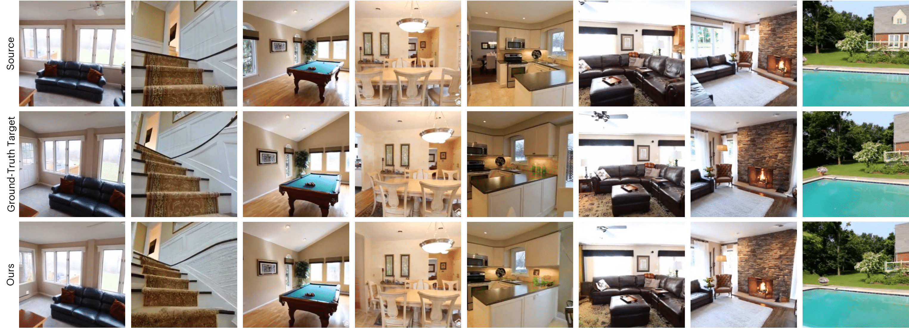

# **VIVID** - Novel View Synthesis with Pixel-Space Diffusion Models<br><sub>Official PyTorch implementation</sub>



**Novel View Synthesis with Pixel-Space Diffusion Models**<br>
Noam Elata, Bahjat Kawar, Yaron Ostrovsky-Berman, Miriam Farber, Ron Sokolovsky<br>
https://arxiv.org/abs/2411.07765<br>

Abstract: *Synthesizing a novel view from a single input image is a challenging task. Traditionally, this task was approached by estimating scene depth, warping, and inpainting, with machine learning models enabling parts of the pipeline. More recently, generative models are being increasingly employed in novel view synthesis (NVS), often encompassing the entire end-to-end system. In this work, we adapt a modern diffusion model architecture for end-to-end NVS in the pixel space, substantially outperforming previous state-of-the-art (SOTA) techniques. We explore different ways to encode geometric information into the network. Our experiments show that while these methods may enhance performance, their impact is minor compared to utilizing improved generative models. Moreover, we introduce a novel NVS training scheme that utilizes single-view datasets, capitalizing on their relative abundance compared to their multi-view counterparts. This leads to improved generalization capabilities to scenes with out-of-domain content.*


## Requirements and Setup

### Environment
Please install a `pytorch > 2` environment on a cuda-supported system, and add the following additional python packages:
```
conda install kornia diffusers transformers accelerate tqdm click Pillow psutil requests scipy tensorboard einops numpy scikit-image
```

For using depth-based models, please also install [DepthAnythingV2](https://github.com/DepthAnything/Depth-Anything-V2).
```
pip install git+https://github.com/DepthAnything/Depth-Anything-V2
```

### Dataset Download
**RealEstate10K:** Download the .txt files from the original published source [here](https://google.github.io/realestate10k/).
We follow the download script provided by [Learning to Render Novel Views from Wide-Baseline Stereo Pairs](https://github.com/yilundu/cross_attention_renderer/blob/master/data_download/README.md) for downloading RealEstate10K.

**Single Image Dataset:** Download [OpenImagesV5](https://storage.googleapis.com/openimages/web/index.html) using the instructions [here](https://storage.googleapis.com/openimages/web/download_v7.html) or any alternative image dataset.

Please place the files in the following format:
```
> ./data
data
├── RealEstate10K
│  ├── test
│  │   ├── 000c3ab189999a83.txt
│  │   └──...
│  └── train
│      ├── 0000cc6d8b108390.txt
│      └──...
├── test
│   ├── 000c3ab189999a83
│   │   ├── 45979267.png
│   │   └──...
│   └── ...
├── train
│   │── 0000cc6d8b108390
│   │   ├── 30874000.png
│   │   └──...
│   └── ...
└── SingleImages
    └── 6134661.png
```


## Sampling from VIVID
To sample from out model, please run the following:

```.bash
python generate_images.py --preset=vivid --outdir=out
```

The above command automatically downloads the necessary models.

```.bash
# Expanded command line for --preset=vivid
python generate_images.py \
    --net=https://ml-site.cdn-apple.com/models/vivid/vivid-base.pkl \
    --gnet=https://ml-site.cdn-apple.com/models/vivid/vivid-uncond.pkl \
    --sr-model=https://ml-site.cdn-apple.com/models/vivid/vivid-sr.pkl \
    --guidance=1.5 \
    --range-selection mid \
    --outdir=out
```

## Calculating metrics

To calculate metrics (FID and PSNR, etc.) directly, please run the following script:
```.bash
torchrun --standalone --nproc_per_node=8 calculate_metrics.py gen --num 10000 \
    --net=https://ml-site.cdn-apple.com/models/vivid/vivid-base.pkl \
    --gnet=https://ml-site.cdn-apple.com/models/vivid/vivid-uncond.pkl \
    --sr-model=https://ml-site.cdn-apple.com/models/vivid/vivid-sr.pkl \
    --guidance=1.5 \
    --range-selection mid
```
Please use `calculate_metrics.py gen --help` to see a full list of possible argument. 

Having generated images with the `generate_images.py`, metrics can be computed using:

```.bash
python calculate_metrics.py calc --images=out
```


We also provide programatic APIs similar for computing metrics.


## Training new models

New models can be trained using `train_nvs.py`. To reproduce our results, run:

```.bash
torchrun --standalone --nproc_per_node=8 train_nvs.py --preset=vivid-base 
torchrun --standalone --nproc_per_node=8 train_nvs.py --preset=vivid-sr 
torchrun --standalone --nproc_per_node=8 train_nvs.py --preset=vivid-uncond 
```

See `python train_nvs.py --help` for the full list of options.

## License

The code in this repository is released under the terms detailed in `LICENSE.txt`, and uses code originally distributed under the license detaled in `ACKNOWLEDGEMENTS.txt`. The accompanying model weights are released under the license listed in `LICENSE-MODEL.txt`.

## Citation

```bibtex
@article{elata2024novel,
  title     = {Novel View Synthesis with Pixel-Space Diffusion Models},
  author    = {Noam Elata and Bahjat Kawar and Yaron Ostrovsky-Berman and Miriam Farber and Ron Sokolovsky},
  journal   = {arXiv preprint arXiv:2411.07765},
  year      = {2024}
}
```

## Acknowledgments

This code is based on the original [EDM2](https://github.com/NVlabs/edm2) implementation, please consider also citing:

```bibtex
@inproceedings{Karras2024edm2,
  title     = {Analyzing and Improving the Training Dynamics of Diffusion Models},
  author    = {Tero Karras and Miika Aittala and Jaakko Lehtinen and
               Janne Hellsten and Timo Aila and Samuli Laine},
  booktitle = {Proc. CVPR},
  year      = {2024},
}
```

